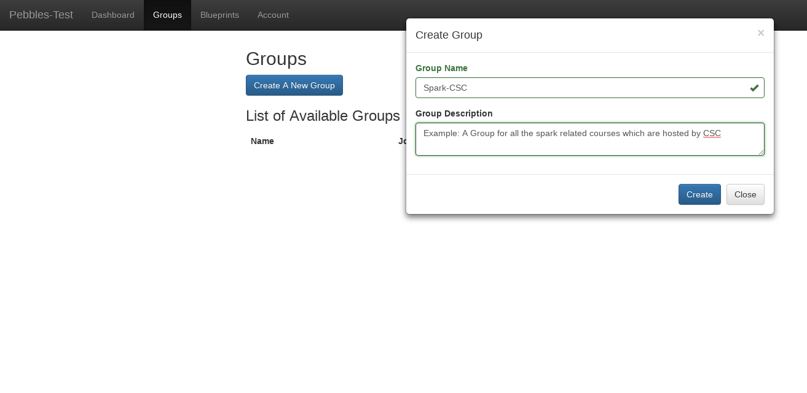
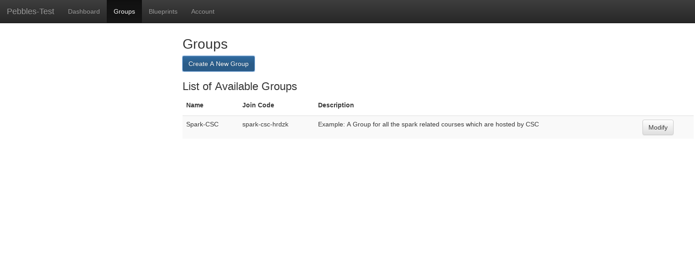
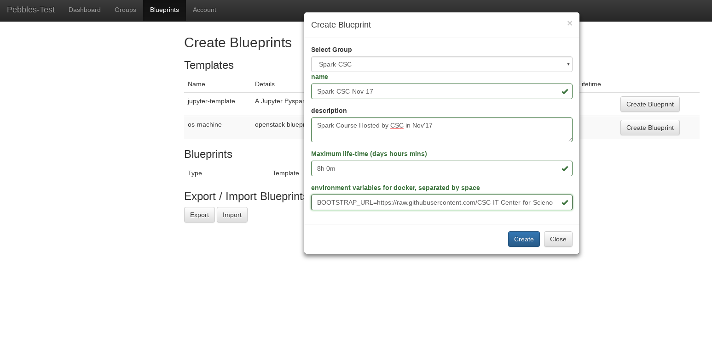
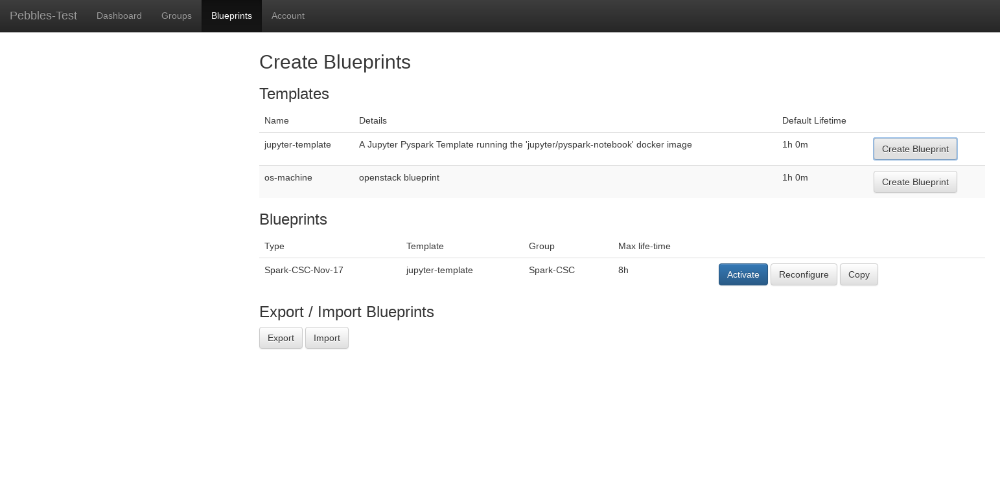
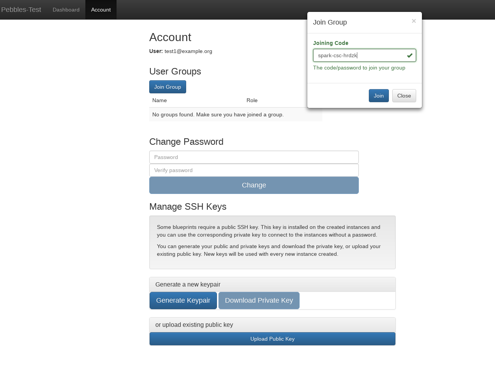

:orphan:

Group Owner's Guide
*******************

Groups give you more control and flexiblity to manage your blueprints for
different sets of users.  A group can contain multiple blueprints and multiple
users in it. Each blueprint that you create based on a given template would
require a mandatory group to associate it with. Hence, the blueprints would
only visible to the users belonging to a specific group.

A group can be joined only if the user has a valid joining code. Upon joining,
he can see the list of blueprints associated with that group.  A group can only
have a single owner i.e. the one who has created the group but it can have
multiple "managers".  If a user is banned from a group, he can no longer see
the blueprints of the said group.  A user is allowed to leave the group if he
wants.

A group owner can perform the following operations:

* create a new group or modify the existing group
* add or remove group managers
* ban or unban a user
* create and modify blueprints on a group which he owns or manages
* check and delete the instances of users running on their groups' blueprints
* launch instances using his groups' blueprints

A group owner can always be a group manager for a group which he doesn't own,
provided he is been appointed to be one.  Similarly, he can also be a normal
user in a group which he doesn't own, provided he has a valid joining code for
a group.

The group manager has slightly less priviledges as compared to group owner. A 
group manager *cannot create or modify an existing group*.
They however have the following rights:

* create and modify blueprints on a group for which they have a right to manage
* check and delete the instances of users running on their groups' blueprints
* launch instances using his managed groups' blueprints

A group manager is always one of the users of the groups that he manages. He
can also join other groups as a normal user if he has a joining code.

A regular user can do the following things on a Pebbles instance:

* Join and exit a group
* Run an instance based on the blueprints belonging to his groups
* Destroy an instance they started earlier

Instructions for creating a group and its blueprint
---------------------------------------------------

**Creating a Group:**

1) Go the Groups tab

2) Click on 'Create A New Group' button. Give a name and description.

3) You should be able to see the group in your groups list now. The joining
code for a group is the code that you'll mail or otherwise communicate to the
users who wish to join your group.

Next step would be to create a blueprint for your group.

**Creating a blueprint:**

1. Click on Blueprints tab

2. You will see a list of templates that admin has created for you to choose
from. From any one of the template, click on Create Blueprint

3. Then choose the group which you want the blueprint to be associated with,
enter the name , description and other properties which you see (if you want
to override the default values)

4. **Set time limit for your blueprint** : You can choose to override the *maximum lifetime* field
(If your template permits it), to suit your course needs. **NOTE: Please do not enter a value
more than 8h-10h** (the blueprints should not be run for more than a day, in case
of multiple day trainings - launch it on a daily basis)

5. **IMPORTANT STEP** : Provide Environment Variables in the field *environment variables for docker* - 
**This step allows you to fetch your own github repo (containing your files, datasets), 
install custom libraries etc , for your blueprints.**
So, when a user launches your blueprint, they will be able to see the files from your github repo and
the necessary libraries directly.
In order to continue with this, you need to enter the following value in the field called 
'environment variables for docker, separated by space' :
``AUTODOWNLOAD_URL=<URL_TO_A_BASH_SCRIPT> AUTODOWNLOAD_EXEC=<BASH_SCRIPT_FILENAME>.bash``

As you can notice, it requires ``<URL_TO_A_BASH_SCRIPT>``. This bash script is responsible for cloning your github repo,
installing your libraries etc. 
An example of the bash script can be found at : https://github.com/CSCfi/notebook-images/blob/master/bootstrap/spark-sql.bash
The above script tries to clone a github repo and then tries to install a python library via pip. The github repo it clones
contains the required files and datasets. You can make your own script in a similar way and host it somewhere on the web.
Replace ``<URL_TO_A_BASH_SCRIPT>`` with the actual URL of your script.

6) Click on Activate button (in the blueprints list) to activate the
blueprint. Now, the users will be able to see the blueprints.

Instructions for Users who wish to join or leave a group
--------------------------------------------------------

**To Join A Group:**

1) Go to Accounts tab -> Join Group 2) Enter the code provided by group admin
or manager

**To Leave A Group:**

1) Go to Accounts tab 2) From the list of groups , click on Exit Group for any
of the groups

**Adding extra managers and banning users (OPTIONAL)**

1) Once the user has joined , click on modify group 2) Select the user(s) in
the banned users / managers multiselct component accordingly.

Github persistence
------------------

See :doc:`github_persistence`
